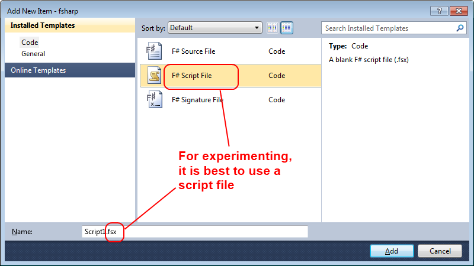
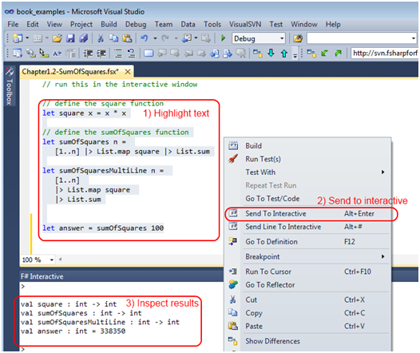
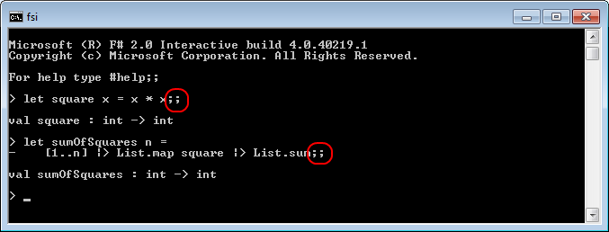

The F# compiler is a free and open source tool which is available for Windows, Mac and Linux (via Mono).
Find out more about F# and how to install it at the [F# Foundation](http://fsharp.org/).

You can use it with an IDE (Visual Studio, MonoDevelop), or with your favorite editor (VS Code and Atom have especially good F# support using [Ionide](http://ionide.io/)), or simply as a standalone command line compiler.

If you don't want to install anything, you can try the [.NET Fiddle](https://dotnetfiddle.net/) site, which is an interactive environment where you can explore F# in your web browser.
You should be able to run most of the code on this site there.

## Working with the code examples ##

Once you have F# installed and running, you can follow along with the code samples.

The best way to run the code examples on this site is to type the code into an `.FSX` script file, which you can then send to the F# interactive window for evaluation.
Alternatively you can type the examples directly into the F# interactive console window.
I would recommend the script file approach for anything other than one or two lines.

For the longer examples, the code is downloadable from this website -- the links will be in the post.

Finally, I would encourage you to play with and modify the examples.
If you then get compiler errors, do check out the ["troubleshooting F#"](/troubleshooting-fsharp/) page, which explains the most common problems, and how to fix them.

### Contents ###

* [Installing F#](#installing-fsharp)
* Using F# with various tools
  * [Using F# in Visual Studio](#visual-studio)
  * [Using F# with Mono on Linux and Mac](#mono-develop)
  * [Try F# directly in your browser](#browser)
  * [Using F# in the FSI interactive shell](#interactive-shell)
  * [Using F# in SharpDevelop](#sharp-develop)
* [Compilation Errors](#compilation-errors)
* [Projects and Solutions](#projects-solutions)
* [Using F# for shell scripts](#shell-scripts)



## Installing F# ##

You can [get F# for multiple platforms here](http://fsxplat.codeplex.com/).
Once you have downloaded and installed F#, you might also consider installing the [F# power pack](http://fsharppowerpack.codeplex.com), which provides a number of nice extras, some of which will be referred to in this site.



## Using F# in Visual Studio

If you are on a Windows platform, using Visual Studio to write F# is strongly recommended, as F# has excellent integration with the IDE, debugger, etc.

* If you have Visual Studio 2010 or higher, F# is already included.
* If you have Visual Studio 2008, you can download an installer for F# from MSDN.
* If you have neither, you can install the "Visual Studio Integrated Shell" and then install F# into that.

Once you have F# installed, you should create an F# project.


And then create a script (FSX) file to run the examples in.



Next, make sure the F# interactive window is active (typically via `View > Other Windows > F# Interactive`).

Using a script file is the easiest way to experiment with F#; simply type in some code in the script window and evaluate it to see the output in the interactive window below.
To evalulate highlighted code, you can:

* Right click to get a context menu and do "send to interactive".
  Note that if the F# interactive window is not visible, the "send to interactive" menu option will not appear.
* Use the `Alt+Enter` key combination (but see note below on keyboard mappings).




#### Resharper alert

If you have Resharper or other plugins installed, the `Alt+Enter` key combination may be taken.
In this case many people remap the command to `Alt+Semicolon` instead.

You can remap the command from the Visual Studio menu `Tools > Options > Keyboard`, and the "Send To Interactive" command is called `EditorContextMenus.CodeWindow.SendToInteractive`.


You can also work directly in the interactive window.
But in this case, you must always terminate a block of code with double semicolons.




## Using F# with Mono on Linux and Mac

F# is included in Mono as of the Mono 3.0.2 release.
[Download Mono here](http://www.go-mono.com/mono-downloads/download.html).

Once you have Mono installed, you can use the MonoDevelop IDE or an editor such as Emacs.

* [MonoDevelop](http://monodevelop.com/) has integrated support for F#.
  See [http://addins.monodevelop.com/Project/Index/48](http://addins.monodevelop.com/Project/Index/48).
* There is an F# mode for Emacs that extends it with syntax highlighting for F#.
  See the ["F# cross-platform packages and samples"](http://fsxplat.codeplex.com/) page on Codeplex.


## Try F# in your browser

If you don't want to download anything, you can try F# directly from your browser.
The site is at [try.fsharp.org](https://try.fsharp.org/).
Note that it does require Silverlight to run.



## Using F# in the interactive shell

F# has a simple interactive console called FSI.exe that can also be used to run code in.
Just as with the interactive window in Visual Studio, you must terminate a block of code with double semicolons.




## Using F# in SharpDevelop

[SharpDevelop](http://www.icsharpcode.net/OpenSource/SD/) has some support for F#.
You can create an F# project, and then within that, create an FSX script file.
Then type in some code in the script window and use the context menu to send the code to the interactive window (as shown below).



## Compilation Errors? ##

If you have problems getting your own code to compile, the ["troubleshooting F#"](/troubleshooting-fsharp/) page might be helpful.


## Projects and Solutions ##

F# uses exactly the same "projects" and "solutions" model that C# does, so if you are familiar with that, you should be able to create an F# executable quite easily.

To make a file that will be compiled as part of the project, rather than a script file, use the `.fs` extension. `.fsx` files will not be compiled.

An F# project does have some major differences from C# though:

* The F# files are organized *linearly*, not in a hierarchy of folders and subfolders.
  In fact, there is no "add new folder" option in an F# project!
  This is not generally a problem, because, unlike C#, an F# file contains more than one class.
  What might be a whole folder of classes in C# might easily be a single file in F#.
* The *order of the files in the project is very important*: a "later" F# file can use the public types defined in an "earlier" F# file, but not the other way around.
  Consequently, you cannot have any circular dependencies between files.
* You can change the order of the files by right-clicking and doing "Move Up" or "Move Down".
  Similarly, when creating a new file, you can choose to "Add Above" or "Add Below" an existing file.


## Shell scripts in F# ##

You can also use F# as a scripting language, rather than having to compile code into an EXE.
This is done by using the FSI program, which is not only a console but can also be used to run scripts in the same way that you might use Python or Powershell.

This is very convenient when you want to quickly create some code without compiling it into a full blown application.
The F# build automation system ["FAKE"](https://github.com/fsharp/FAKE) is an example of how useful this can be.

To see how you can do this yourself, here is a little example script that downloads a web page to a local file.
First create an FSX script file -- call it "`ShellScriptExample.fsx`" -- and paste in the following code.

```fsharp
// ================================
// Description:
//    downloads the given url and stores it as a file with a timestamp
//
// Example command line:
//    fsi ShellScriptExample.fsx http://google.com google
// ================================

// "open" brings a .NET namespace into visibility
open System.Net
open System

// download the contents of a web page
let downloadUriToFile url targetfile =
    let req = WebRequest.Create(Uri(url))
    use resp = req.GetResponse()
    use stream = resp.GetResponseStream()
    use reader = new IO.StreamReader(stream)
    let timestamp = DateTime.UtcNow.ToString("yyyy-MM-ddTHH-mm")
    let path = sprintf "%s.%s.html" targetfile timestamp
    use writer = new IO.StreamWriter(path)
    writer.Write(reader.ReadToEnd())
    printfn "finished downloading %s to %s" url path

// Running from FSI, the script name is first, and other args after
match fsi.CommandLineArgs with
    | [| scriptName; url; targetfile |] ->
        printfn "running script: %s" scriptName
        downloadUriToFile url targetfile
    | _ ->
        printfn "USAGE: [url] [targetfile]"
```

Don't worry about how the code works right now.
It's pretty crude anyway, and a better example would add error handling, and so on.

To run this script, open a command window in the same directory and type:

```
fsi ShellScriptExample.fsx http://google.com google_homepage
```

As you play with the code on this site, you might want to experiment with creating some scripts at the same time.
